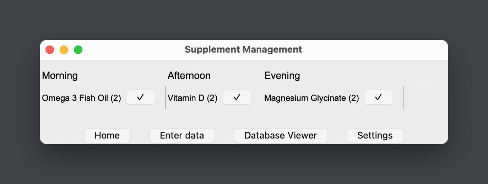
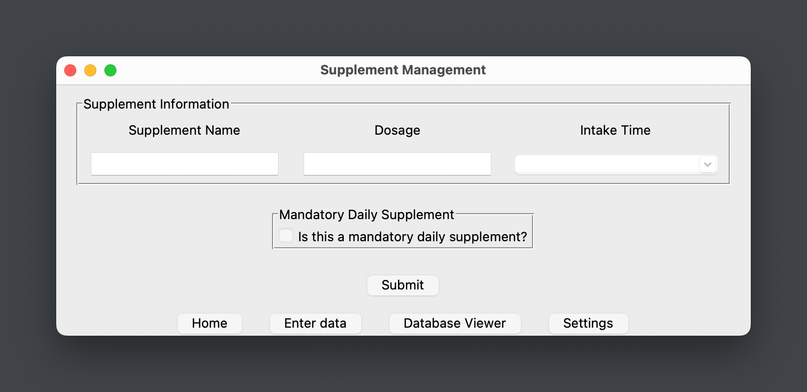
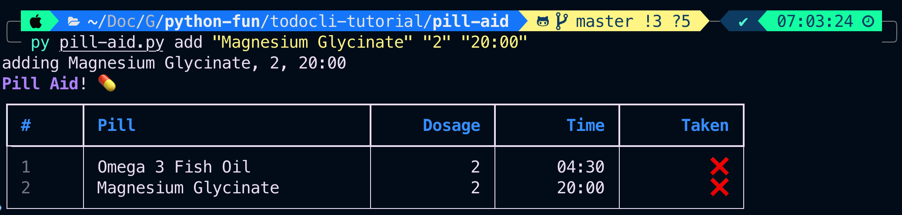
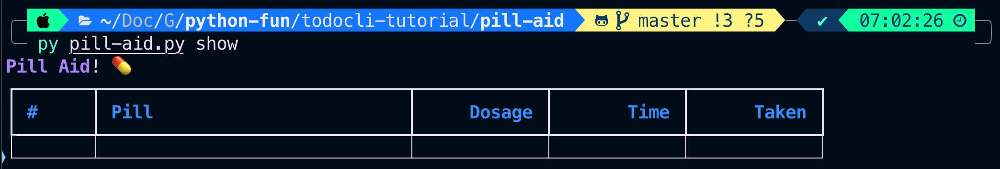

# cs32-final
## Final Update. 2023-05-02

### Functions
1. clear_form: Clears the form input fields.
2. enter_data: As a user, adds the input data to the SQLite database.
3. show_schedule: Retrieves and displays the supplement intake schedule.
4. refresh_schedule_view: Refreshes the supplement schedule view.
5. switch_frame: Switches the displayed frame in the tkinter UI.
6. update_schedule: Updates the app's schedule daily.
7. show_database: Queries and displays the SQLite database.
8. on_select: Stores the selected supplement in the database viewer.
9. show_edit_frame: Opens a new tkinter Toplevel window for editing a selected supplement entry.
10. edit_selected_entry: Edits an SQLite database entry for a supplement.
11. remove_entry: Removes a supplement from the SQLite database.
12. apply_settings: Applies and updates the intake notification times.
13. send_notifications: Sends notifications based on the notification times set.

### Libraries/Modules Used
* tkinter: GUI toolkit for Python
* sqlite3: SQLite Database handling
* random: Shuffle and pick supplements for the schedule
* time: Time-based functions and threading
* threading: Handles updating the app's schedule and notifications
* datetime: Functions for parsing and handling date and time
* pync: Handles desktop notifications

## Other Important Points
* 3 intake times: Morning, Afternoon, and Evening
* SQLite Database Storage: Stores the supplement data with mandatory daily statuses.
* Notifications: Notifications are sent at user-defined times reminding them to take their supplements.
* UI: Switch between Home Frame, Data Entry Frame, Database Viewer Frame, and Settings Frame
* Multiple Threads: App handles daily schedule updates and notifications using separate threads.

**This is an easy-to-use supplement management system that stores and organizes the user's supplement schedule, making it less likely the user will forget their intake.**

---

## Outdated README.md
## The subtasks can be decomposed as follows:
1. Design different week cycles with different supplements.
2. Keep track of the supplements used and remaining stock.
3. Implement notification reminders for taking supplements and restocking.
4. Create a password-protected personal website.
5. Integrate a supplement manager and a bill payment manager.
6. Add a package manager and a tool to replace text.
7. Include a makeshift checklist, kanban board, and note-taking functionality.
8. Explore the possibility of integrating an email manager.
9. Incorporate an AI API + Wolfram/Mathematica AI integration. (this one I may scrap due to complexity, and the probability this project will become redundant in the [very close future](https://writings.stephenwolfram.com/2023/03/chatgpt-gets-its-wolfram-superpowers/)… OpenAI must have stolen my idea from my FP Details and Timeline assignment :./).

## Out of these subtasks, the computational subtasks can be identified as follows:

### 1. Explore the possibility of integrating an email manager:
   * Implementing an email management API that allows users to manage emails using the website, seeing that we can use testmail.app this seems like a very good idea.
   * Check for Leverett Package Centre emails?, could also act as a package notifier??
   * This seems to be an easy addition to my overall project.
   
### 2. #Keep track of the supplements used and remaining stock:
   * This task can be solved computationally by implementing a database system that keeps track of the supplements' usage and stock levels.
   * Using an algorithm that sends reminders to my phone or email based on the consumption pattern of the supplements? 
   * [This one _also_ seems good!](https://web.dev/push-notifications-in-all-modern-browsers/)

I will aim to incorporate both within the website I create, but for now I may probably start with the email manager, (since I can probably finish that one first). Hopefully it goes well :)

---

# Update #2

## Pill and Assignment Aid 

 
Pill and Assignment Aid is a CLI app I developed as a framework to my final project which helps a user keep track of their medication intake. I wanted to add an extra feature so that the app is not only a pill aid but also an assignment aid, which fetches the API to get an updated list of school assignments when needed. But thats the future plan, for now, I'll be focusing on finalising the pill aid!

### Current Features:

 

* Display all the pills with their information and whether they have been taken or not.
* Add a pill with its name, dosage, and time.
* Delete a pill by its position in the list.
* Update a pill's information by its position in the list.
* Mark a pill as taken by its position in the list.

   
### Future Plans 

* Integrate Canvas API to fetch and display the list of school assignments along with their due dates and completion status
* Add macOS notifications to remind users about taking their pills and upcoming assignment deadlines.
* Implement live tracking for the app to keep the pill intake and assignment progress up-to-date.
* Enhance the user interface for better user experience (I personally prefer CLI apps over GUI apps but everyone has their own preferences c:)

### If you want to try it out:

1. Clone the repository.
2. Run the command `pip install -r requirements.txt` to install the required packages. Or you can install the packages manually by running `pip install rich typer`.
3. Run the command `python3 pill.py` in your integrated terminal to run the script!
4. Choose a command to perform an action (add, delete, update, take, show). 

## Project Progress 
 
I started by creating a sample input for the script and then began thinking about how the script would process the input. I decided to go with a **SQLite3** database for storing the pill information and implemented the basic CRUD operations. I also created a model.py file to define the Medicine class and a database.py file to handle all the interactions with the SQLite3 database. I then built the main pill.py script to interact with the user and perform the required actions. 

Moving forward, I'll be focusing on integrating the Canvas API to fetch school assignments and incorporating notifications for pill reminders and assignment deadlines. Finally, I'll work on improving the user interface and implementing live tracking to keep the information up-to-date. Maybe even changing the script to a web app? We'll see how that goes. Also maybe using a different database system? I'm not sure yet.